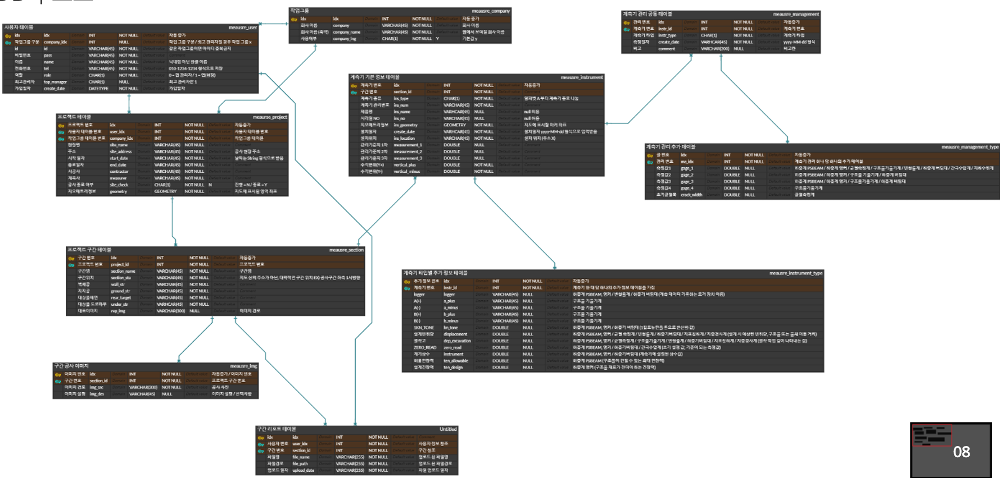
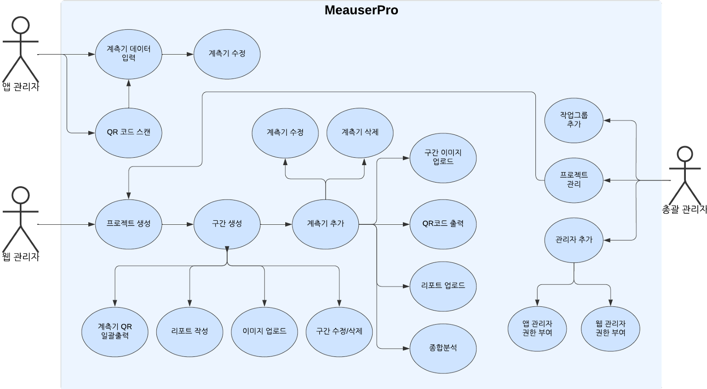

# 🏢 MeasurePro
토목 계측 웹/앱 프로젝트

# 📝 프로젝트
> 개발기간 : 2024.10.02 ~ 2024.10.24

# 👥 개발인원
> 5명

# 💻 담당역할
> 웹 UI, 이미지 업로드(서버) 기능구현

# 👩‍💻 Skills
1. 백엔드
>

2. 프론트엔드
>

# 📚 ERD & USE-CASE

ERD

USE-CASE

# 주요기능
1. 웹
> 지도에 공사 진행하는 위치를 지정하고 프로젝트를 생성하여 관리를 할수 있습니다.  
구간을 정하여 생성후 계측기를 지도에 클릭하여 생성하면 계측기별 다른 아이콘이 지도에 생성됩니다.  
종합분석지를 이용하여 해당 구간 계측기들의 차트를 모아볼 수 있습니다. 
구간에 대한 리포트를 업로드/다운로드 하여 확인할 수 있습니다.  
구간 이미지 업로드/다운로드 하여 프로젝트를 확인할 수 있습니다. 
QR코드 출력/일괄출력 하여 해당 프로젝트의 계측기 QR코드 출력이 가능합니다.

2. 앱
> 현장 관리자가 접속하여 진행중인 프로젝트 리스트 확인이 가능하고,  
구간 리스트 계측기 리스트 또한 확인이 가능합니다.  
계측기 QR코드를 스캔하여 해당 계측기 데이터를 확인할 수 있고,  
계측기 측정값을 입력할 수 있습니다. 측정값 입력시 웹사이트 종합분석지에 그래프가 반영되어 확인이 가능합니다.
